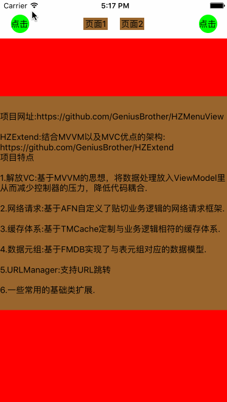

##HZMenuView##
以UINavigationController为容器,且导航页面时不关闭的侧边栏(No close slideMenu)

####本项目交流群:32272635
####欢迎有兴趣的有好的想法的同学参与到项目中来，如果有问题请大家加入群中留言或者issue我，或者发邮件给我zuohong_xie@163.com

##Preview##


##添加##
```ruby
下载文件直接将HZMenuView文件夹添加到项目中
```

##其它资源##
* [简书论坛](http://www.jianshu.com/collection/ba017346481d)
* [HZExtend,快速开发项目的框架,结合了MVC和MVVM的优点](https://github.com/GeniusBrother/HZExtend)
* [HZURLManager,使用URL进行导航跳转(support URL to navigate)](https://github.com/GeniusBrother/HZURLManager)

##应用架构的基本思路##
```ruby
1.以导航控制器为容器。
2.HZMenuView本质是个内容页,可以在rootViewCtrl.view上可以左右滑动的,是几个模块页面的父视图。
3.子模块只能封装在UIView里而不是UIViewController里。
```

##初始化##
```objective-c
/**
  *  初始化
  *  LeftViewWidth:左边侧栏的宽度
  *  rightViewWidth:0表示无右边侧边栏
  */
HZMenuView *menuView = [HZMenuView menuViewWithLeftViewWidth:kLeftSlidWidth rightViewWidth:0 delegate:self];
menuView.backgroundColor = [UIColor whiteColor];
menuView.frame = self.view.bounds;
[self.view addSubview:menuView];
```
##侧栏控制##
####打开侧栏
```objective-c
//打开左边侧栏
[self.menuView openLeftMenu];

//打开右边侧栏
[self.menuView openRightMenu];
```

####关闭侧栏
```objective-c
[self.menuView closeMenu];
```

##回调##
```objective-c
typedef NS_ENUM(NSInteger, MenuView) {
    MenuViewLeft = 0,           //menu类型为左边栏
    MenuViewRight = 1,          //menu类型为右边栏
};
@class HZMenuView;
@protocol HZMenuViewDelegate<NSObject>

@optional
/**
 *  menu将要打开时调用,并传回打开的menu类型
 */
- (void)menuView:(HZMenuView *)menuView willOpenSlide:(MenuView)slide;

/**
 *  menu打开后调用,并传回打开的menu类型
 */
- (void)menuView:(HZMenuView *)menuView didOpenSlide:(MenuView)slide;

/**
 *  menu将要关闭时调用,并传回关闭的menu类型
 */
- (void)menuView:(HZMenuView *)menuView willCloseSlide:(MenuView)slide;

/**
 *  menu关闭后调用,并传回关闭的menu类型
 */
- (void)menuView:(HZMenuView *)menuView didCloseSlide:(MenuView)slide;
@end
```
##其它##
```objective-c
typedef NS_ENUM(NSInteger, MenuViewStatus) {
    MenuViewStatusClose = 0,    //menu为关闭状态
    MenuViewStatusLeft = 1,     //menu为左边开启状态
    MenuViewStatusRight = 1,    //menu为右边开启状态
};

@interface HZMenuView : UIView

@property(nonatomic, assign, readonly) MenuViewStatus status;   //侧栏是否开启的状态

@end
```
